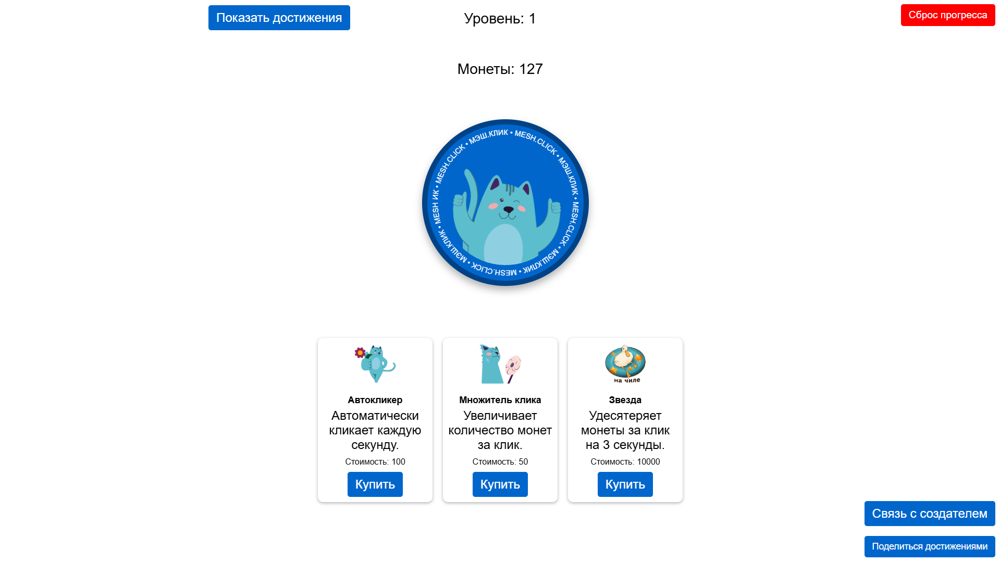

# Mesh Click

  
Mesh Click – это простая браузерная кликер-игра, в которой игроки кликают по большой монете и улучшают свои способности.
Игра доступна на [сайте](example.com)
Маскотом игры выступает кот из Московской электронной школы (МЭШ) по имени Мэшик.

## Особенности

- Система уровней  
- Три различных улучшения
- Достижения
- Секреты
- Генератор именного сертификата достижений

## Отказ от ответственности
Автор данного проекта не имеет отношения к Московской электронной школе (МЭШ).
В случае возникновения претензий со стороны владельцев/правообладателей МЭШ, я готов удалить проект по их требованию.
Для связи: [Telegram](https://t.me/llukyanov).